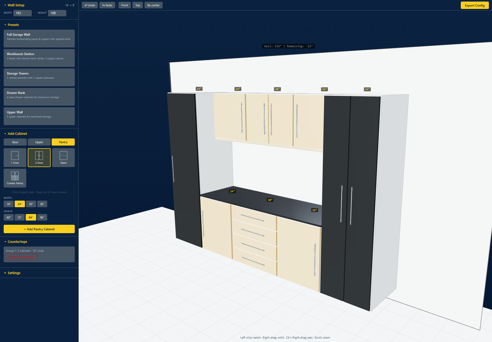

# Cabinet Configurator Interface

A 3D garage cabinet configurator built with React and Three.js. Design custom cabinet layouts by dragging and dropping cabinets onto a virtual wall, adjusting sizes, styles, and finishes in real time.



## Features

- **3D Viewport** &mdash; Interactive scene with orbit, pan, and zoom controls
- **Cabinet Types** &mdash; Base, upper, and pantry cabinets with multiple door/drawer styles (1-door, 2-door, drawer banks, combo pantry, etc.)
- **Drag & Drop** &mdash; Drag cabinets from the sidebar directly into the 3D workspace
- **Preset Layouts** &mdash; Pre-configured cabinet arrangements (full garage wall, workbench station, storage towers, drawer bank, upper wall)
- **Customization** &mdash; Adjustable width, height, and depth with preset size options
- **Applied Ends** &mdash; Decorative end panels for left, right, and bottom sides
- **Countertops** &mdash; Auto-generated countertops that span base cabinets with smart overhang handling
- **Multi-Select** &mdash; Click, Shift+click, and marquee drag selection
- **Copy/Paste/Duplicate** &mdash; Ctrl+C, Ctrl+V, Ctrl+D with ghost placement preview
- **Undo/Redo** &mdash; Full history with Ctrl+Z / Ctrl+Y
- **Collision Detection** &mdash; Cabinets snap to grid and prevent overlapping
- **Export** &mdash; Export configurations as JSON

## Tech Stack

- **React 18** + TypeScript
- **React Three Fiber** (R3F) + drei for 3D rendering
- **Three.js** 0.176
- **Zustand** for state management with zundo (undo/redo middleware)
- **Vite** for development and builds

## Getting Started

```bash
# Install dependencies
npm install

# Start development server
npm run dev

# Build for production
npm run build

# Preview production build
npm run preview
```

## Controls

| Action | Input |
|--------|-------|
| Select cabinet | Left-click |
| Multi-select | Shift+click or marquee drag |
| Orbit camera | Right-drag |
| Pan camera | Ctrl+Right-drag |
| Zoom | Scroll wheel |
| Undo / Redo | Ctrl+Z / Ctrl+Y |
| Copy / Paste | Ctrl+C / Ctrl+V |
| Duplicate | Ctrl+D |
| Select all | Ctrl+A |
| Delete selected | Delete / Backspace |
| Cancel action | Escape |

## License

Private
